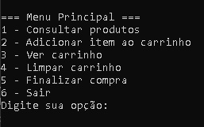

# 🛒 Projeto Prático P2 - Algoritmo e Lógica de Programação - Carrinho de Compras

  
*Interface do menu principal em execução no terminal.*

## 📌 Sobre o Projeto

Integrantes da equipe: Roberto Henrique dos Santos - Desenvolvedor do projeto

Este projeto é um sistema simples de compras em console, desenvolvido com **C#**. Ele simula um fluxo básico de compras com um catálogo de camisetas e oferece funcionalidades comuns de um e-commerce: exibição de produtos, adição ao carrinho, visualização, limpeza e finalização de compra. O código fonte do projeto tem explicações didáticas explicativas por meio de comentários que esclarece o que partes importantes do código executa.

O objetivo é demonstrar habilidades de manipulação de listas, estrutura de menus interativos, controle de fluxo e boas práticas com formatação UTF-8 para suportar acentuação em português.

## ⚙️ Funcionalidades

- **🛍️ Catálogo de Produtos:**  
  Exibe uma tabela formatada com os itens disponíveis para compra, incluindo códigos, descrições e preços.

- **➕ Adicionar Item ao Carrinho:**  
  Permite ao usuário escolher um item do catálogo por meio de seu código, adicionando-o ao carrinho junto com o preço correspondente.

- **📦 Ver Carrinho:**  
  Lista todos os itens atualmente adicionados ao carrinho, juntamente com os respectivos valores e o total da compra.

- **🧹 Limpar Carrinho:**  
  Exibe uma opção para limpar todos os itens do carrinho ou mantê-los, conforme a escolha do usuário.

- **💳 Finalizar Compra:**  
  Realiza a compra exibindo o conteúdo final do carrinho e agradecendo ao usuário. Caso o carrinho esteja vazio, a compra é cancelada.

- **🚪 Sair:**  
  Encerra o programa a qualquer momento.

## 🧠 Tecnologias Utilizadas

- Linguagem: **C#**
- Plataforma: **.NET Console Application**
- Codificação: **UTF-8** para suporte completo a caracteres acentuados
- Estrutura de dados: `List<T>` para manipulação dinâmica do carrinho

## 🖼️ Exemplo de Execução (ASCII Preview)

```plaintext
=== Menu Principal ===
1 - Consultar produtos
2 - Adicionar item ao carrinho
3 - Ver carrinho
4 - Limpar carrinho
5 - Finalizar compra
6 - Sair
Digite sua opção:
